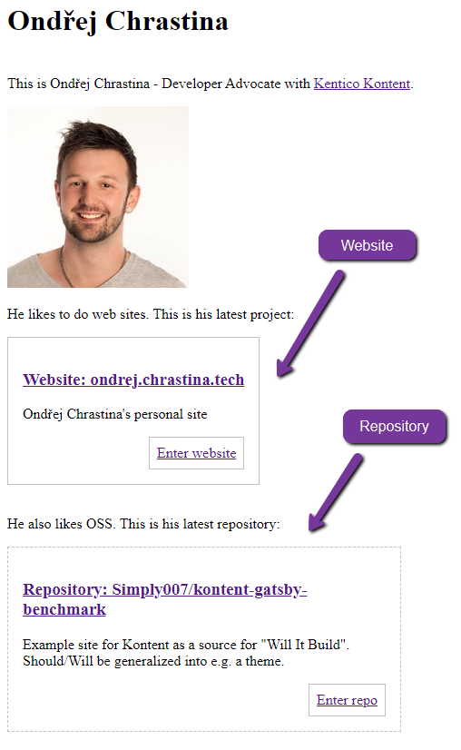
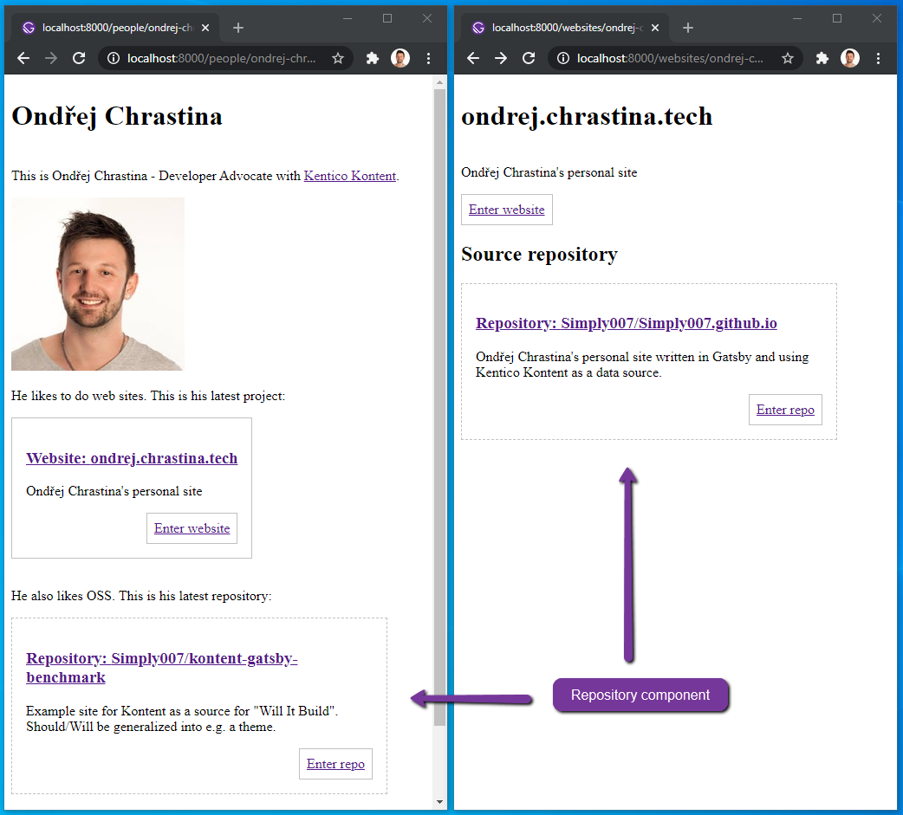
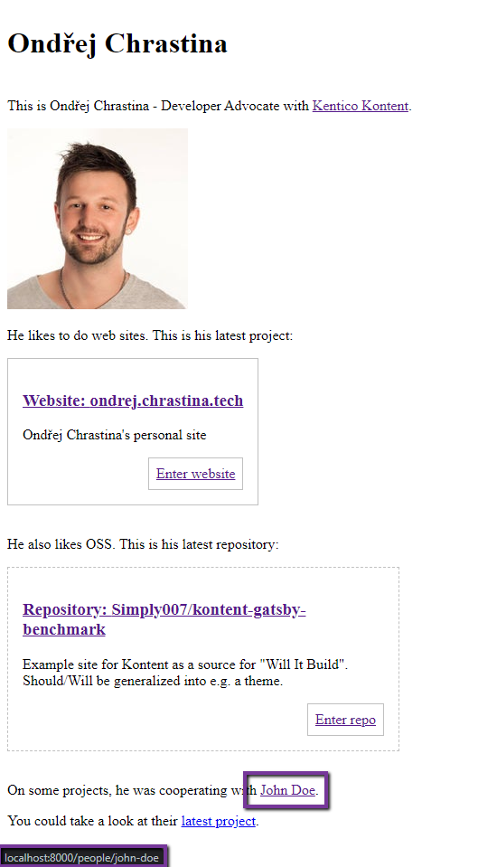
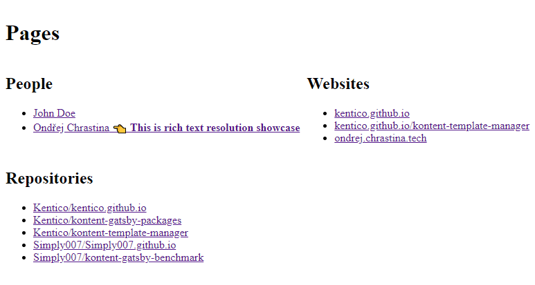

# Gatsby Resolution Example

[](https://app.netlify.com/sites/kontent-gatsby-example-resolution/deploys)

Site showcasing how to resolve Rich Text element and it's inline images, incline content items, and content components.

## Get started

:warning: Before running any of the following scripts locally ensure the site is using the latest dependencies

```sh
# In the root folder of this repo
yarn # install all required packages
yarn build # build the latest version of the local packages
```

### Develop site

```sh
# open the /example/navigation folder
cd example/navigation
yarn develop # runs `gatsby develop` command
```

Now you could browse the site on <http://localhost:8000> and see GraphiQL explorer on <http://localhost:8000/___graphql>.

## Content modeling

This section explains how the content is modeled. You could follow next section of [Import the content to your on Kontent project](#Import-site-content-to-your-Kontent-project) and explore the models by your own as well as the sample data based on it.

Once you create the content models, you could create content items based on these and the site would be capable to handle the content and render it.

### Kontent content models

First of of all it is required to create two content types:

- `Person` - which will represent a person on our website and mainly `Bio` rich text element used for resolution showcase
- `Repository` - this content type represents a github repository information - used as an inline lik item from Person's `Bio` element
- `Website` - this content type represents a website information - used as an inline lik item from Person `Bio` element

#### Person content modeling

Following section describes ths content structure (content model). If you want, you could 

This content type - `Person` - has following structure:

- Name - **Text** element
- Bio - **Rich text** element - configures to allow to link only `Repository` and `Website` content types
- Slug - **URL slug** element - generated from name

This content type represents people with their `Bio`. They could link any website, or repository to their bio and these components needs to be resolved.

In case you want to link external URL to different domain, it is possible to extend the content type by **Text** element called i.e. _External URL_.

#### Repository and Website Content type

`Repository` and `Website` content types has following structure. They are pretty similar, they are used to showcase the resolution of inline linked items in the rich text element (`Bio` element of the person).

`Repository`

- Name - **Text** element
- Summary - **Text** element
- URL - **Text** element
- Slug - **URL slug** element - generated from name

`Website`

- Name - **Text** element
- Summary - **Text** element
- URL - **Text** element
- Slug - **URL slug** element - generated from name
- Source repository - **Linked items** element - configures to allow only `Repository` content type

## Import site content to your Kontent project

If you want to import content types with the sample content in your own empty project, you could use following guide:

1. Go to [app.kontent.ai](https://app.kontent.ai) and [create empty project](https://docs.kontent.ai/tutorials/set-up-kontent/projects/manage-projects#a-creating-projects)
1. Go to "Project Settings", select API keys and copy `Project ID`
1. Install [Kontent Backup Manager](https://github.com/Kentico/kontent-backup-manager-js) and import data to newly created project from [`kontent-backup.zip`](./kontent-backup.zip) file (place appropriate values for `apiKey` and `projectId` arguments):

   ```sh
   npm i -g @kentico/kontent-backup-manager

   kbm --action=restore --apiKey=<Management API key> --projectId=<Project ID> --zipFilename=kontent-backup
   ```

   > Alternatively, you can use the [Template Manager UI](https://kentico.github.io/kontent-template-manager/import-from-file) for importing the content.

1. Go to your Kontent project and [publish all the imported items](https://docs.kontent.ai/tutorials/write-and-collaborate/publish-your-work/publish-content-items).

### Connect the site to custom project

Open the `gatsby-config.js` file and set following properties for `@kentico/gatsby-source-kontent` plugin:

- `projectId` from *Project settings > API keys > Delivery API > Project ID*
- `languageCodenames` from *Project settings > Localization*

## Rich text resolution

For all `Person` content items, there is [a new page created](./gatsby-node.js#L65) based on on the [`templates/person.js`](./src/templates/person.js) template. The template is using [Gatsby Kontent Components](../../packages/gatsby-kontent-components#readme) package, specifically it's `RichTextElement` to resolve the content component, inline linked items, and images.

> The main example is on <http://localhost:8000/people/ondrej-chrastina/> that showcase [the content component, inline linked items, and images resolution of the Bio element](./src/templates/person.js).



### Reusing components

You could re-use the React components on multiple places.

The `Bio` rich text resolution in [`templates/person.js`](./src/templates/person.js) is using the `src/components/repository.js` component as well as the same component is used on the [`templates/website.js`](./src/templates/website.js) for linked items resolution.



## URL resolution

For all `Person` content items, there is [a new page created](./gatsby-node.js#L65) based on on the [`templates/person.js`](./src/templates/person.js) template. The template is using [utils/resolvers/](./src/utisl/resolvers.js#L1) to resolve links to other content items into the URLs in the `Bio` element.

The main example is on <http://localhost:8000/people/ondrej-chrastina/> that showcase [URL resolution of the `Bio` element](./src/templates/person.js) - in this case the link to `John Doe`.



The overall resolution of the urls for content items in on <http://localhost:8000/>. There is an overview of resolved URLs for all content items based on `Person`, `Repository`, and `Website` content type.



### More complex scenarios

If you want to configure more complex and multi-level routing, take a look to the [Navigation example](../navigation#readme) and the you could use resolved URLs in combination with the unified URL resolution.

