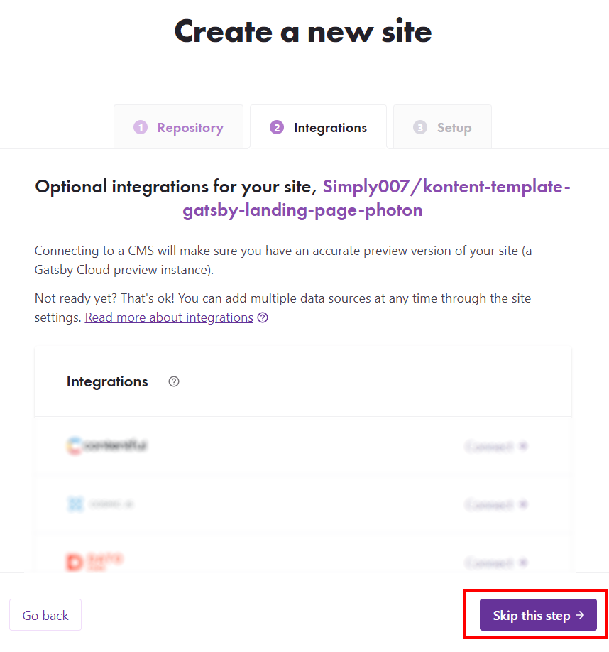
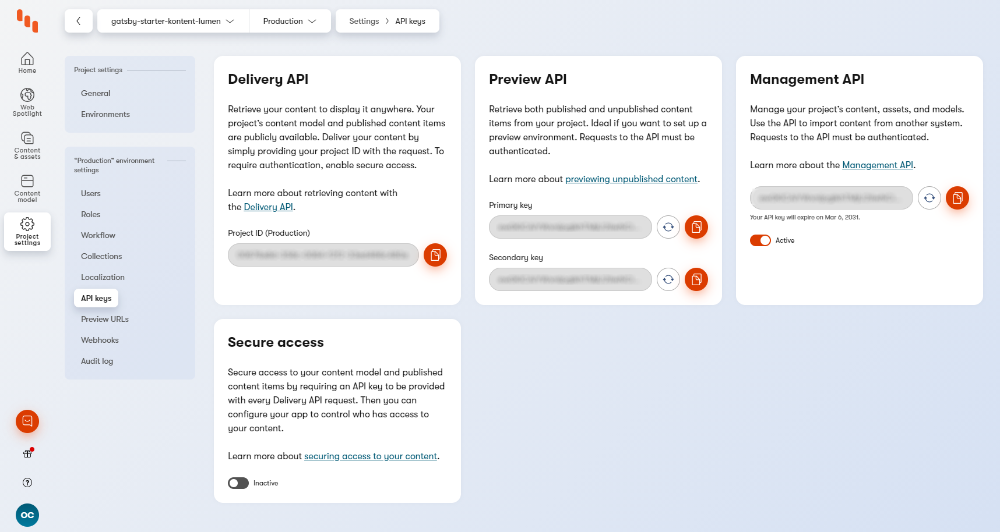
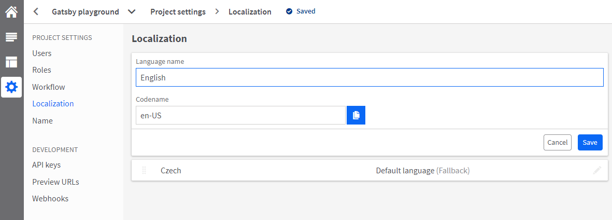
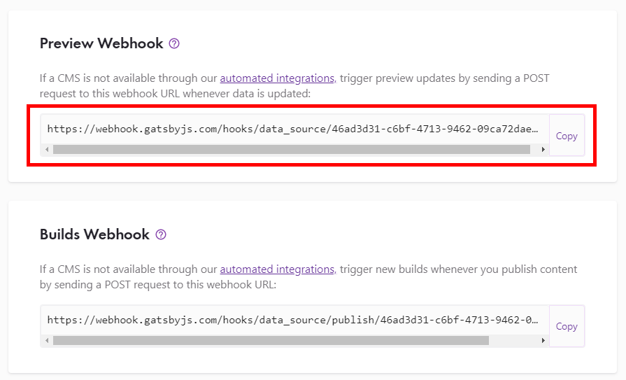
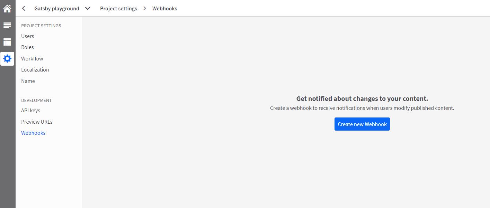
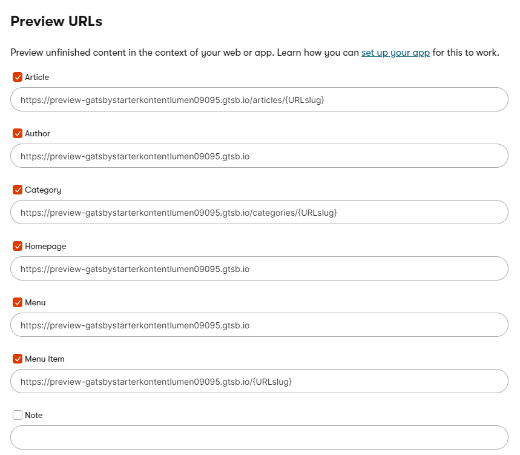
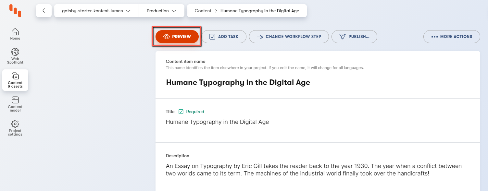

# Getting started with Gatsby Cloud and Kontent

Learn how to connect Gatsby Cloud with Kontent based Gatsby site.

In this tutorial you will discover, how to easily integrate site sourced by Kentico Kontent with Gatsby Cloud.

You will

* Create a website using data from Kentico Kontent.
* Store its source Code on GitHub.
* Register this Github repository in Gatsby Cloud.
* Configure Kentico Kontent webhooks to notify Gatsby Cloud about the content changes on preview environment as well as on production.
* Configure preview URLs in Kentico Kontent to.

## What are Gatsby Cloud and Kontent, and why use them together

[Kontent](https://kontent.ai) is a headless CMS that content editors can use to edit and publish content. It is  Content-as-a-Service solution that gives enterprises control over their entire content lifecycle in a single unified environment. Gatsby Cloud allows you to integrate your site with Kontent in order to run performant builds and preview content changes made in the CMS before publishing.

## Setting up a Kontent and Gatsby site

First, you’ll need a Gatsby site with a [gatsby-source-kontent](https://www.gatsbyjs.org/packages/@kontent/gatsby-source-kontent) source plugin pulling data from Kontent. If you haven’t set that up yet, you can quickly create a new project by using the [gatsby-starter-kontent-lumen](https://github.com/Kentico/gatsby-starter-kontent-lumen) repository. To achieve it, walk though the [Getting started](https://github.com/kentico/gatsby-starter-kontent-lumen#getting-started) section.

## Signing in to Gatsby Cloud

[Access Gatsby Cloud](https://gatsbyjs.com/dashboard/sites/create) and select **Sign in with GitHub**  You’ll be asked to authorize the Gatsby Cloud app with your GitHub account. If you need to request access to one or more repositories, you can click "request access" here or later, when creating an instance.

*Once signed in, configuring Gatsby Cloud with Kontent requires several steps that are walked through below.*

### Creating an instance

Once you are registered, you could start with [registering you GitHub repository](https://gatsbyjs.com/dashboard/sites/create).

Use the **I already have a Gatsby sit** flow to manually integrate your site.

Pick your Gatsby site from the list of GitHub repositories. You can use the search input to narrow down the list.

If you don’t see your site, it might be because it belongs to a GitHub organization, rather than your personal account. You can connect a new GitHub Organization.

*Note: Repositories must contain one Gatsby project configured at their root to be enabled. Gatsby Cloud works best with Gatsby version 2.20.36 and higher.*

### Select branch and publish directory

You’ll need to select a branch and then indicate the publish directory where the gatsby-config.js lives. If you leave the field blank, it defaults to the root of the site.

Once the branch and base directory are correct, select "Next".

### Create the instance

First, click **Skip this step** to configure Kontent manually.

*Gatsby Cloud will automatically try and detect environment variables necessary in your `gatsby-config.js`. However — consider adding any additional variables that automatic detection may have missed. See ["Setting up Environment Variables"](#setting-up-environment-variables) for more info. Note that you will be able to add, delete, or update these later on in "Site Settings".*

### Setting up Environment Variables

*An environment variable references a value that can affect how running processes will behave on a computer, for example in staging and production environments. You must save environment variables in Gatsby Cloud to authorize your instance to pull source data from Kontent.*

Open you your Kontent project, on the "Project settings" tab, click on "API Keys".

You will need to grab the following values from this window:

* Project ID
* Preview API key (Primary or Secondary)

In your Kontent project, on the "Localization" tab get codenames of the localizations for your project.

* Language **codenames** ([`gatsby-starter-kontent-lumen`](https://github.com/Kentico/gatsby-starter-kontent-lumen) is using `en-US,cs-CZ`)

Value | Environment Variable Name
------------ | -------------
Project ID | KONTENT_PROJECT_ID
Preview API key | KONTENT_PREVIEW_KEY
Language codenames | KONTENT_LANGUAGE_CODENAMES

You will want to set KONTENT_PREVIEW_ENABLED to `true` for Preview and `false` for Builds.

**Click `Save` once you’ve entered you’re variables**

Click **Create site**.

Go to "Preview" tab and wait for the preview instance to be created.

## Webhooks: Configuring your Gatsby site to be updated with content changes

To make a connection between Kontent and Gatsby Cloud for your site, you’ll need to [configure a webhook](https://docs.kontent.ai/reference/webhooks-reference) in Kontent so that content changes can be pushed to Gatsby Cloud.

You’ll set up two webhooks in Kontent:

* one for Gatsby Preview
* one for Gatsby Builds

### Adding a Preview Webhook

Navigate to your Gatsby Cloud instance, and press **Site Settings**. Copy the Preview Webhook on this page.

Open Kontent app, go to "Project settings" tab and select "Webhooks"

Select **Create new Webhook**.

Name the webhook and paste the Preview webhook copied from the Gatsby Cloud Dashboard to URL address.

And select only triggers in section "DELIVERY PREVIEW API TRIGGERS"

* Create or Update
* Delete

Click **Save**.

*Your Preview webhook is now ready! When you change your content in Kontent, your Gatsby Preview will update!*

### Adding a Build Webhook

Navigate to your Gatsby Cloud instance, and press **Site Settings**. Copy the Build Webhook on this page.

Open Kontent app, go to "Project settings" tab and select "Webhooks"

Select **Create new Webhook**.

Name the webhook and paste the Build webhook copied from the Gatsby Cloud Dashboard to URL address.

And select only triggers in section "DELIVERY API TRIGGERS"

* Publish
* Unpublish

Click **Save**

*Your Build webhook is now ready! When you publish/unpublish content in Kontent, your Gatsby Build will update!*

## Setting the Gatsby Preview Domain for Kontent

To be able to open the Gatsby Cloud preview right from the Kentico Kontent, it is necessary to [configure preview URLs](https://docs.kontent.ai/tutorials/develop-apps/build-strong-foundation/set-up-preview#a-set-up-content-preview-in-your-project) for your content.

*Assuming you are using [`gatsby-starter-kontent-lumen`](https://github.com/Kentico/gatsby-starter-kontent-lumen) project.*

Navigate to your Gatsby Cloud instance, and press **Preview**. Copy the preview URL.

Open Kontent app, go to "Project settings" tab and select "Preview URLs".

Configure the URLs according to routes configuration.

Now you are able to open the preview right from Kentico Kontent user interface.

## Wrapping Up

At this point, you now have a Kontent instance configured to best support Gatsby Cloud. Edit content, click the Preview button and watch it appear live in Gatsby Cloud!